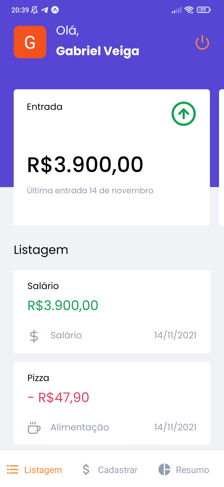
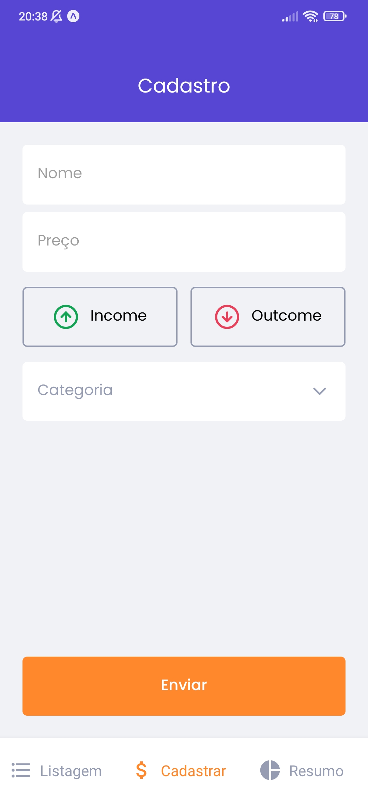
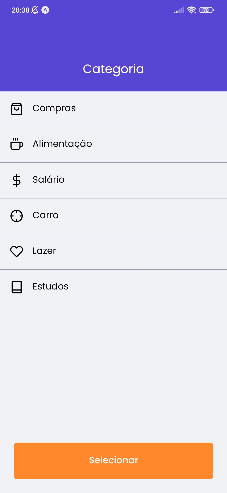
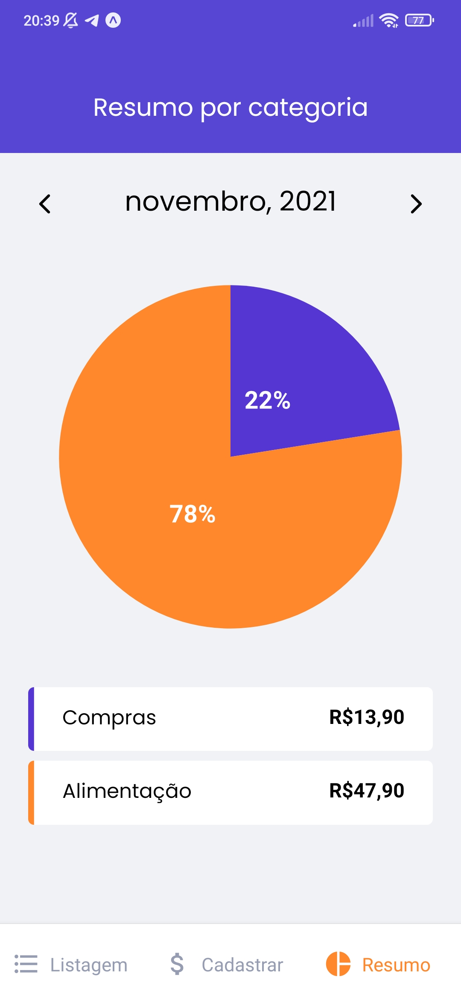

<h1 align="center">
    
</h1>

<h4 align="center"> 
  GoFinances • Concluído 🚀
</h4>

<p align="center">
 <a href="#-sobre-o-projeto">Sobre</a> •
 <a href="#-funcionalidades">Funcionalidades</a> •
 <a href="#-layout">Layout</a> • 
 <a href="#-como-executar-o-projeto">Como executar</a> • 
 <a href="#-tecnologias">Tecnologias</a> • 
 <a href="#-autor">Autor</a> • 
 <a href="#user-content--licença">Licença</a>
</p>


## 💻 Sobre o projeto

GoFinances - Aplicativo para gerenciamento de finanças.


Projeto desenvolvido durante a trilha de React Native do Ignite oferecida pela [Rocketseat](https://blog.rocketseat.com.br/).

---

## ⚙️ Funcionalidades

- [x] Realizar login social com Google ou Apple (Apenas Iphone)
- [X] Adicionar uma entrada de dinheiro
- [X] Adicionar uma saída de dinheiro
- [X] Escolher a categoria
- [X] Listar todas as movimentações
- [X] Resumo com total de entradas, saídas e o total
- [X] Gráfico de resumo de gastos por categoria

---

## 🎨 Layout

O layout da aplicação está disponível no Figma:

<a href="https://www.figma.com/file/EgOhyj1Inz14dhWGVhRlhr/GoFinances?node-id=0%3A1">
  
</a>


<p align="center">
   
   
   
   
   
</p>


---

## 🚀 Como executar o projeto

### Pré-requisitos

Antes de começar, você vai precisar ter instalado em sua máquina as seguintes ferramentas:
[Git](https://git-scm.com), [Node.js](https://nodejs.org/en/), [Expo Cli](https://docs.expo.dev/get-started/installation/). 
Além disto é bom ter um editor para trabalhar com o código como [VSCode](https://code.visualstudio.com/)

Caso tenha dificuldades em instalar e rodar o projeto, acesse o tutorial da [Rocketseat](https://react-native.rocketseat.dev/) para fazer o 
setup no seu sistema operacional.

#### 🧭 Rodando a aplicação

```bash

# Clone este repositório
$ git clone https://github.com/Veigabriel25/gofinances.git

# Acesse a pasta do projeto no seu terminal/cmd
$ cd gofinances

# Instale as dependências
$ yarn ou npm install

# Se estiver usando emulador ou celular android rode
$ expo start

```

---

## 🛠 Tecnologias

As seguintes ferramentas foram usadas na construção do projeto:

- [React Native](https://reactnative.dev)
- [JavaScript](https://developer.mozilla.org/pt-BR/docs/Web/JavaScript)
- [TypeScript](https://www.typescriptlang.org)
- [Expo](https://expo.io/)
- [Styled-components](https://styled-components.com/)
- [React Hook Form](https://react-hook-form.com/)
- [Yup](https://github.com/jquense/yup)
- [Victory Native](https://formidable.com/open-source/victory/docs/native/)


## 💪 Como contribuir para o projeto

1. Faça um **fork** do projeto.
2. Crie uma nova branch com as suas alterações: `git checkout -b my-feature`
3. Salve as alterações e crie uma mensagem de commit contando o que você fez: `git commit -m "feature: My new feature"`
4. Envie as suas alterações: `git push origin my-feature`
> Caso tenha alguma dúvida confira este [guia de como contribuir no GitHub](./CONTRIBUTING.md)

## 🎉 Conquistas

- Experiência em criar componentes e temas com o styled-components
- Experiência em criar formúlarios com o react hook form e validá-los com o yup
- Experiência em utilizar a context api e criar hooks personalizados

---

## 🦸 Autor

Gabriel Veiga

[](https://www.linkedin.com/in/gabriel-veiga-874625110/) 

---

## 📝 Licença

Este projeto esta sobe a licença [MIT](./LICENSE).
